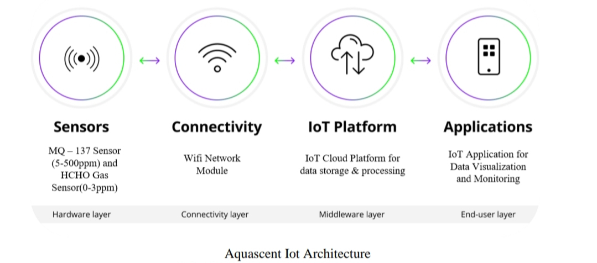
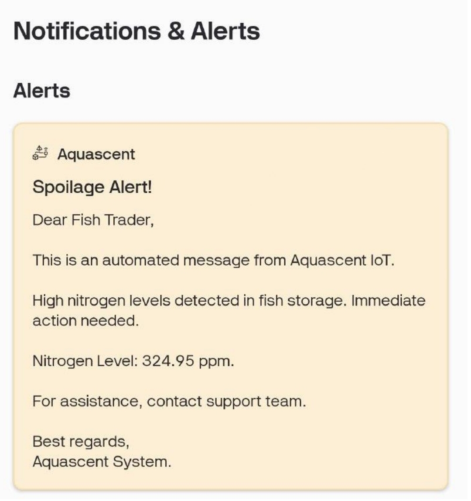
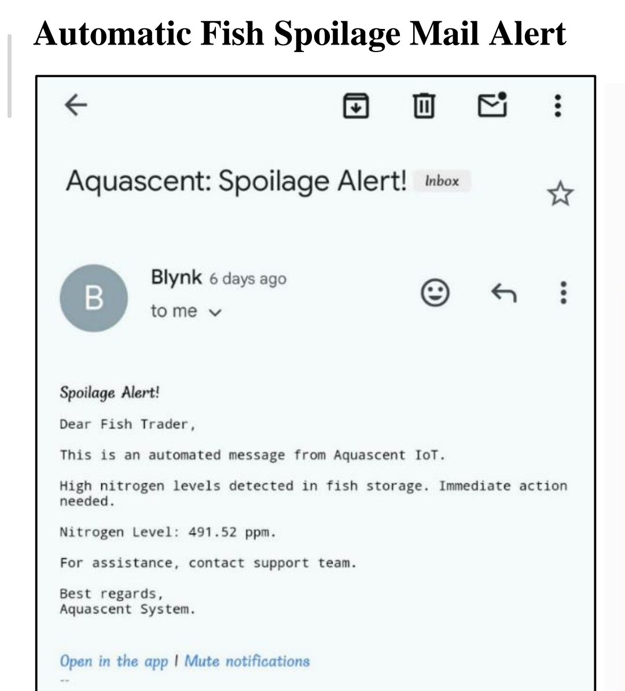

# IoT-Based Smart Aquaculture Monitoring System (Aquascent)

## 1. Problem Statement
In the aquaculture industry, post-harvest losses due to spoilage and illegal adulteration (using Formalin) are major economic challenges. Traditional methods of checking fish freshness are subjective and slow. This project designs an IoT monitoring solution that monitors **Ammonia (Nitrogen)** and **Formaldehyde** levels in real-time to trigger alerts before spoilage occurs.

## 2. System Architecture
The system follows a 3-layer IoT architecture:
* **Sensing Layer (Edge):** Arduino Uno R3 connected to gas sensors and environmental sensors. It processes raw analog signals into PPM values locally using specific calibration curves.
* **Connectivity Layer (Gateway):** NodeMCU ESP8266 receives processed data via SoftwareSerial communication and transmits it to the cloud via Wi-Fi (802.11 b/g/n).
* **Application Layer (Cloud):** Blynk IoT platform visualizes data in real-time and manages the automated email alert engine.

## 3. Hardware & Material Details
The system is built using a cost-effective combination of chemical sensors and microcontrollers.

  
   
  <i>(Fig: Complete Hardware Setup & Component List)</i>

| Component | Specification/Details | Function |
| :--- | :--- | :--- |
| **Arduino Uno R3** | ATmega328P Microcontroller | Primary processing unit for Analog-to-Digital conversion (ADC) and PPM calculation. |
| **NodeMCU ESP8266** | Wi-Fi SoC | IoT Gateway to transmit data from Arduino to Blynk Cloud. |
| **MQ-137 Sensor** | Range: 5-500 ppm | Detects Ammonia ($NH_3$) which indicates protein breakdown (spoilage). |
| **Grove HCHO** | Range: 0-5 ppm | Detects Formaldehyde (Formalin) used in illegal fish adulteration. |
| **DHT22** | Digital Temp/Humidity | Monitors cold chain integrity ($4^{\circ}C$ vs $-18^{\circ}C$). |
| **OLED Display** | 1.3 inch (I2C) | Displays real-time sensor readings locally for on-site checking. |
| **Active Buzzer** | 5V DC | Provides local audio alarms when critical thresholds are breached. |

## 4. Sensor Justification & Thresholds
| Parameter | Sensor | Safe Limit | Critical Action |
| :--- | :--- | :--- | :--- |
| **Spoilage (Nitrogen)** | MQ-137 | < 320 ppm | Trigger "Spoilage Alert" Email to Trader. |
| **Adulteration** | Grove HCHO | 0.0 ppm | Detect presence of carcinogens (Formalin). |
| **Storage Temp** | DHT22 | $< 4^{\circ}C$ | Monitor for cold chain breaks. |

## 5. System Workflow & Logic
The device follows a strict 6-step loop to ensure data accuracy:

1.  **Initialization:** Sensors are pre-heated (20 mins) to stabilize the chemical heating element.
2.  **Acquisition:** Sensors detect gas concentration changes, altering the conductivity of the internal $SnO_2$ material.
3.  **Edge Calculation (Arduino):** * Reads analog voltage ($V_{RL}$).
    * Calculates Sensor Resistance ($R_S$): `Rs = ((5.0 * RL) / V_RL) - RL`
    * Converts to PPM using Logarithmic Regression: `PPM = pow(10, ((log10(Rs/R0) - b) / m))`
4.  **Data Packet Construction:** Arduino formats data into a serial string: `F:value,N:value,T:value,H:value`.
5.  **Cloud Transmission:** NodeMCU parses the string and pushes data to Blynk Virtual Pins (V0-V3) via Wi-Fi.
6.  **Alert Execution:** * **Condition:** `IF Nitrogen_PPM > 320`
    * **Action:** `Blynk.logEvent("spoilage_alert")` fires, sending an immediate email notification to the registered user.

## 6. Project Demo Video
https://github.com/user-attachments/assets/ee2d9609-0d87-4056-8e8c-b813ee3e88c5

## 7. Sample Output
<table>
  <tr>
    <td align="center">
      
       
      <b>Fig 1: Blynk IoT Mobile App Alert</b>
    </td>
    <td align="center">
      
       
      <b>Fig 2: Automated Email Alert</b>
    </td>
  </tr>
</table>

<table>
  <tr>
    <td align="center">
      
       
    </td>
    <td align="center">
      
       
    </td>
    <td align="center">
      
       
    </td>
  </tr>
     <td colspan="3" align="center">
      <b>Fig 3-5: Real-time Aquascent Blynk IoT Dashboard</b>
    </td>
</table>
